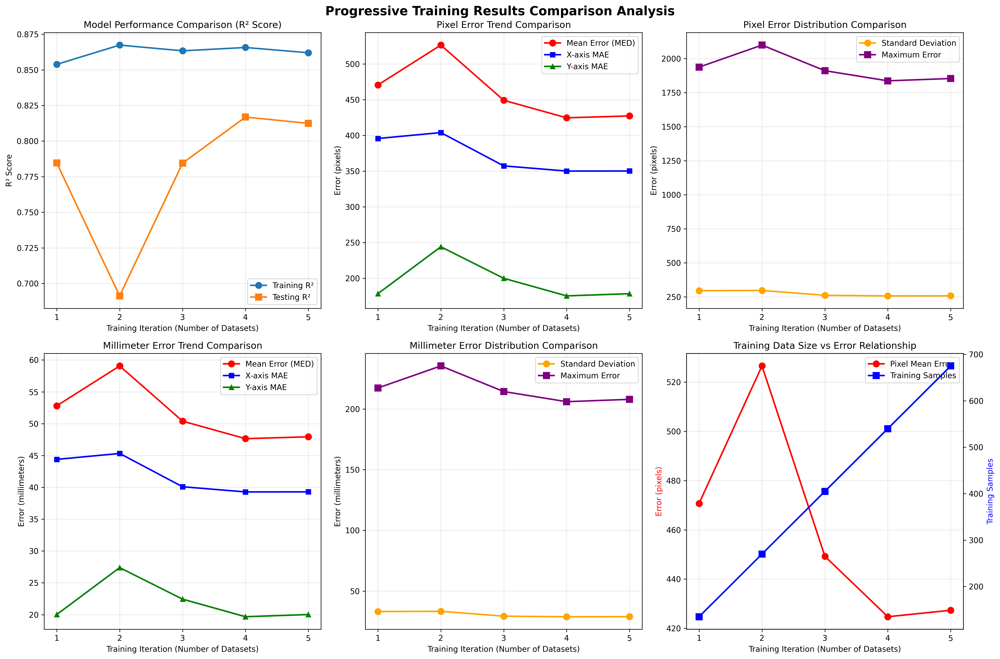

# NeuGaze: 基于头部动作、面部表情与凝视的计算机控制系统

**中文文档 | [English](README.md)**

[](https://arxiv.org/abs/2504.15101)
[](https://www.bilibili.com/video/BV1kKdYYVEEM/#reply270100925344)

一个结合面部表情识别、头部动作追踪和凝视估计的非侵入式计算机控制系统，专为免手操作的人机交互而设计。

## 项目概述

传统辅助技术存在显著局限：像Neuralink这样的侵入式脑机接口需要手术植入，Tobii等商业眼动仪缺乏复杂操作的精度，传统辅助设备往往涉及繁琐的控制方式。NeuGaze通过整合面部表情、头部动作和凝视估计来解决这些挑战，创造出直观的免手控制系统。

**硬件要求：**

- 📷 标准摄像头（无需特殊硬件）
- 💻 仅CPU运行（无需GPU）
- 🪟 目前支持Windows（其他平台可能可用但未测试）

**核心特性：**

- 🎯 **基于凝视的鼠标控制** 实时校准
- 😊 **面部表情映射** 键盘/鼠标操作
- 🎮 **三模态控制** 结合凝视、表情和头部动作
- ⚙️ **可定制配置** 适用于不同使用场景
- 🚀 **实时性能** CPU优化推理

## 性能评估

我们使用多个校准数据集进行了渐进式训练的综合测试。系统在经过多次训练后，在3072×1920显示屏上实现了稳定的凝视追踪性能，平均误差约为**48毫米**，再经过卡尔曼滤波后误差为40毫米。目前性能确实比tobii的效果差不少，可以一起共创。



*渐进式训练结果显示了多个数据集的误差减少和性能稳定性。分析表明随着更多训练数据的加入，凝视精度持续改善。*

## 安装说明

### 快速安装（推荐）

#### Windows用户
```cmd
# 双击运行安装脚本
install.bat
```


脚本会自动：
1. 检查Python版本和conda环境
2. 创建名为 `neugaze` 的conda环境
3. 指导你激活环境并安装依赖

### 环境配置


```bash
# 创建并激活conda环境
conda create -n neugaze python=3.11.11
conda activate neugaze

# 安装所有依赖
pip install -r requirements.txt
```

## 快速开始

### 1. 启动图形界面

```bash
python config_gui_cpu.py
```

### 2. 摄像头设置

- 选择摄像头（默认：摄像头0）
- 将面部位置调整到预览窗口中央
- 点击"确认选择"


### 3. 校准

- 点击"开始校准"
- 用眼睛跟随屏幕上的点
- 保持眼睛睁开（只有检测到眼睛时才拍照）
- 等待校准完成

### 4. 开始控制

- 点击"开始评估"
- 鼠标光标现在将跟随您的凝视
- 使用面部表情触发操作

## 表情与控制配置

NeuGaze使用在 `configs/cpu.yaml`中定义的复杂表情识别系统。系统支持多种控制模式和可定制映射。

### 表情检测

系统通过MediaPipe关键点识别面部表情并将其映射到特定操作：

#### 核心表情

- **张嘴 (`jawOpen`)**：*自然地张开下颌* → 模式选择器 - 显示可用控制轮盘
- **嘟嘴 (`mouthPucker`)**：*做出亲吻动作，嘴唇撅起* → 鼠标左键点击
- **下颌左移 (`jawLeft`)**：*将下颌向左侧移动* → 鼠标右键点击
- **下颌右移 (`jawRight`)**：*将下颌向右侧移动* → 鼠标中键点击
- **左侧微笑 (`mouthSmileLeft`)**：*只用嘴的左侧微笑* → 导航/选择
- **右侧微笑 (`mouthSmileRight`)**：*只用嘴的右侧微笑* → 导航/选择
- **双侧微笑**：*自然的双侧完整微笑* → 特殊命令
- **头部动作**：*倾斜、转动和点头* → WASD键和滚动

#### 表情配置示例

```yaml
left_click:
  conditions:
  - feature: mouthPucker
    operator: '>'
    threshold: 0.97
  - feature: mouthFunnel
    operator: <
    threshold: 0.2
  combine: AND
```

### 控制模式

系统通过轮盘界面支持多种操作模式：

#### 1. 黑悟空游戏模式 (`game`)

针对游戏优化，包含WASD移动和常用游戏键：

- **num1**：Z/X/C键（切棍）
- **num2**：Shift键（冲刺/蹲下）
- **num4**：数字键1-4（技能选择）
- **num6**：Q/R/F/T键（操作选择）
- **num8**：空格键（闪避）

#### 2. CS:GO模式 (`game_cs`)

专为反恐精英设计的战术绑定：

- **num2**：空格键（跳跃）
- **num8**：Shift键（走路/精确射击）
- **鼠标锁定**：禁用以实现精确瞄准

#### 3. 王者荣耀模式 (`game_wz`)

针对MOBA游戏优化：

- **num1-3**：技能激活（技能1-3）
- **num4**：地图（M键）

#### 4. 打字模式 (`type`)

完整键盘访问用于文本输入：

- **num4**：方形布局的完整字母表
- **num6**：方形布局的数字和符号
- **num2**：修饰键（Shift、Ctrl、Alt等）
- **num3**：常用快捷键（Ctrl+C、Ctrl+V等）

### 高级配置

#### 表情优先级

系统包含优先级规则以防止冲突表情：

```yaml
priority_rules:
- when: num7
  disable: [num2]
  except: []
```

#### 轮盘布局

不同输入模式支持不同的轮盘布局：

- **默认**：圆形排列
- **方形**：字母和符号的网格布局（`layout_type: square`）

#### 头部动作集成

头部方向控制附加功能：

- **俯仰（上/下）**：W/S键
- **偏航（左/右）**：A/D键
- **翻滚（倾斜）**：滚轮

## 使用场景

### 无障碍辅助

- **行动辅助**：为行动不便的用户提供免手计算机操作
- **康复训练**：通过控制头部和面部动作进行运动技能训练

### 游戏娱乐

- **沉浸式游戏**：为增强游戏体验提供新颖输入方法
- **肌肉训练**：通过交互控制进行面部和颈部肌肉锻炼

### 智能设备集成

- **AR/VR界面**：头戴显示设备的自然控制
- **智能眼镜**：基于表情的导航，无需手势

## 技术细节

### 架构

- **意图识别**：对面部表情、头部动作和凝视模式的综合分析
- **意图映射**：将识别的意图转换为特定的键盘/鼠标操作
- **多模态融合**：多个同时意图的集成和优先级处理
- **动作执行**：协调控制系统，实现复杂的游戏操作
- **优化**：为实时性能优化的CPU推理管道

### 局限性

- **光照敏感性**：在光照不良或不均匀时性能下降
- **需要校准**：需要个人校准以获得最佳精度
- **表情学习**：自然表情控制存在学习曲线

## 贡献

我们欢迎贡献！请随时提交问题、功能请求或拉取请求。

## 引用

```bibtex
@article{yang2024neugaze,
  title={NeuGaze: Facial Expression and Gaze-Based Computer Control},
  author={Yang, Yiqian},
  journal={arXiv preprint arXiv:2504.15101},
  year={2024}
}
```

## 许可证

[](https://creativecommons.org/licenses/by-nc/4.0/)

本项目采用知识共享署名-非商业性使用4.0国际许可证。

**您可以自由地：**

- ✅ 个人使用时分享和改编代码
- ✅ 用于研究和教育目的
- ✅ 为非商业目的创建衍生作品（如直播、内容创作）

**您不可以：**

- ❌ 销售源代码或衍生作品
- ❌ 部署为商业硬件/软件产品
- ❌ 打包为付费可执行应用程序
- ❌ 用于商业网络服务

我们免费提供此软件以造福社区，同时防止商业实体的剥削。许可条款可能根据社区反馈更新为Apache-2.0或MIT协议。

---

**注意**：本系统专为研究和无障碍目的设计。虽然功能完备，但可能需要个人调整以获得最佳性能。我们鼓励实验并欢迎反馈以改进系统的稳健性和可用性。
