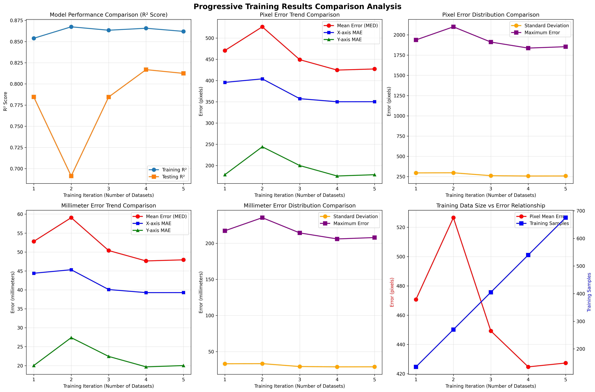
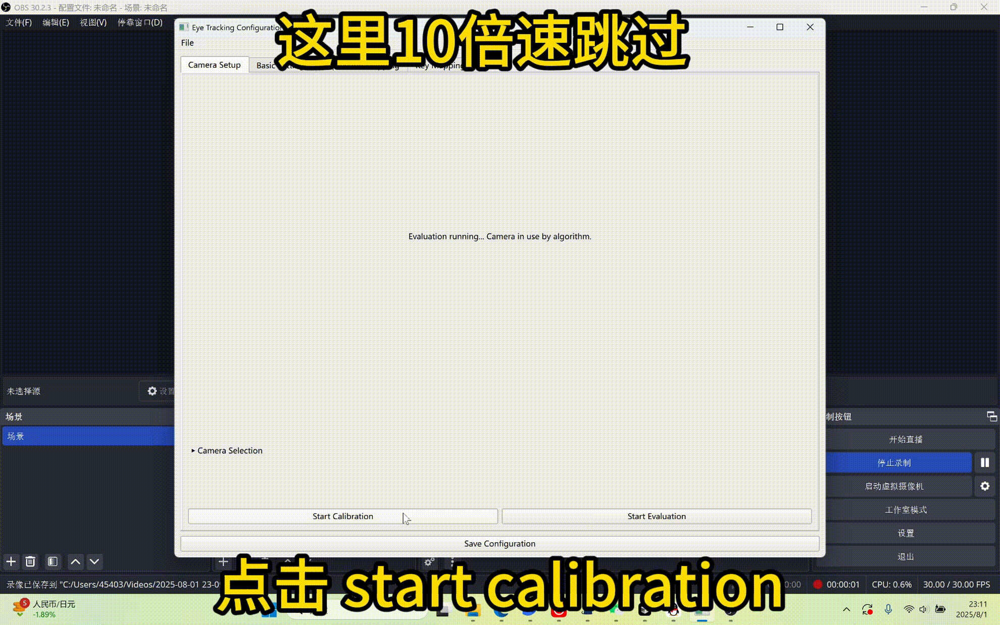

# 🎯 NeuGaze: Facial Expression & Gaze-Based Computer Control

<div align="center">

**[中文文档](README-CN.md) | English**

[](https://arxiv.org/abs/2504.15101)
[](https://www.bilibili.com/video/BV1kKdYYVEEM/#reply270100925344)
[](https://www.python.org/)
[](https://www.microsoft.com/)
[](https://creativecommons.org/licenses/by-nc/4.0/)

*A non-invasive computer control system that combines facial expression recognition, head movement tracking, and gaze estimation, designed for hands-free human-computer interaction.*

This system enables complex action game control, as demonstrated in the video showing Black Myth: Wukong defeating the Yin Tiger boss. It can also be used to play MOBA games like Honor of Kings, FPS games like CS2, and many other game types.

<div align="center">
    <h3>NeuGaze wukong</h3>
    <video src="https://github.com/user-attachments/assets/2b604e6e-7468-470c-a3df-afc302ffedb0" />
</div>
---

We are hosting a global CS2 Arms Race Challenge: 2000 RMB for the champion. The first participant to complete the setup, achieve kills in Arms Race against bots, and publish a tutorial video will receive an additional 500 RMB bonus.

## 📋 Table of Contents

- [🎯 Overview](#-overview)
- [📊 Performance Evaluation](#-performance-evaluation)
- [🚀 Installation](#-installation)
- [🎮 Quick Start](#-quick-start)
- [😊 Expression & Control Configuration](#-expression--control-configuration)
- [🎯 Use Cases](#-use-cases)
- [⚙️ Technical Details](#️-technical-details)
- [🤝 Contributing](#-contributing)
- [📄 License](#-license)

---

## 🎯 Overview

Traditional assistive technologies face significant limitations: invasive brain-computer interfaces like Neuralink require surgical implantation, commercial eye trackers like Tobii lack precision for complex operations, and traditional assistive devices often involve cumbersome controls. **NeuGaze** addresses these challenges by integrating facial expressions, head movements, and gaze estimation to create an intuitive, hands-free control system.

### 🖥️ Requirements

| Component | Requirement | Description |
|-----------|-------------|-------------|
| 📷 **Camera** | Standard webcam | No special hardware needed |
| 💻 **Processor** | CPU-only operation | No GPU required |
| 🪟 **OS** | Windows | Other platforms may work but untested |

### ⭐ Key Features

<div align="center">

| Feature | Description | Icon |
|---------|-------------|------|
| **Gaze-based mouse control** | Real-time calibration, precise tracking | 🎯 |
| **Facial expression mapping** | Keyboard/mouse action mapping | 😊 |
| **Three-modal control** | Combining gaze, expressions, and head movements | 🎮 |
| **Customizable configurations** | Adaptable for different use cases | ⚙️ |
| **Real-time performance** | CPU-optimized inference | 🚀 |

</div>

---

## 📊 Performance Evaluation

We conducted comprehensive testing using progressive training on multiple calibration datasets. The system achieves stable gaze tracking performance with the following metrics:

### 📈 Performance Metrics

- **Mean Error**: **48mm** (original)
- **After Kalman Filtering**: **40mm** (optimized)
- **Display Resolution**: 3072×1920
- **Training Data**: Multiple calibration datasets

> 💡 **Note**: Current performance is indeed inferior to Tobii's results, but we welcome community collaboration for improvements!



*Progressive training results showing error reduction and performance stability across multiple datasets. The analysis demonstrates consistent improvement in gaze accuracy as more training data is incorporated.*

---

## 🚀 Installation

### 🎯 Recommended Installation

#### Windows Users
```cmd
# Double-click to run the installation script
install.bat
```

<details>
<summary>📋 Script Function Details</summary>

The script will automatically:
1. ✅ Check Python version and conda environment
2. ✅ Create a conda environment named `neugaze`
3. ✅ Guide you to activate the environment and install dependencies
4. ✅ Verify successful installation

</details>

### 🔧 Manual Environment Setup

```bash
# Create and activate conda environment
conda create -n neugaze python=3.11.11
conda activate neugaze

# Install all dependencies
pip install -r requirements.txt
```

---

## 🎮 Quick Start

### 📹 Video Tutorial

Watch this video to quickly understand the system usage:



### 📋 Step-by-Step Guide

#### 1️⃣ Launch the GUI

```bash
python config_gui_cpu.py
```

#### 2️⃣ Camera Setup

- 📷 Select your camera (default: camera 0)
- 👤 Position your face in the center of the preview window
- ✅ Click "Confirm Selection"


#### 3️⃣ Calibration Process

- 🎯 Click "Start Calibration"
- 👁️ Follow the on-screen dots with your gaze
- 👀 Keep your eyes open (photos are only taken when eyes are detected)
- ⏳ Wait for calibration to complete

#### 4️⃣ Start Control

- 🎮 Click "Start Evaluation"
- 🖱️ Your mouse cursor will now follow your gaze
- 😊 Use facial expressions to trigger actions

---

## 😊 Expression & Control Configuration

NeuGaze uses a sophisticated expression recognition system defined in `configs/cpu.yaml`. The system supports multiple control modes and customizable mappings.

### 🎭 Expression Detection

The system recognizes facial expressions through MediaPipe landmarks and maps them to specific actions:

#### Core Expression Mapping

| Expression | Action Description | Triggered Operation |
|------------|-------------------|---------------------|
| **Open Mouth** (`jawOpen`) | *Drop your jaw naturally* | 🎯 Mode selector - displays available control wheels |
| **Pucker Lips** (`mouthPucker`) | *Make a kissing motion with pursed lips* | 🖱️ Left mouse click |
| **Jaw Left** (`jawLeft`) | *Shift your jaw to the left side* | 🖱️ Right mouse click |
| **Jaw Right** (`jawRight`) | *Shift your jaw to the right side* | 🖱️ Middle mouse click |
| **Smile Left** (`mouthSmileLeft`) | *Smile with only the left side of your mouth* | 🧭 Navigation/selection |
| **Smile Right** (`mouthSmileRight`) | *Smile with only the right side of your mouth* | 🧭 Navigation/selection |
| **Both Sides Smile** | *Full natural smile with both sides* | ⚡ Special commands |
| **Head Movements** | *Tilt, turn, and nod your head* | ⌨️ WASD keys and scrolling |

#### Expression Threshold Adjustment

```cmd
python learn\mediapipe_example.py
```

You can use this program to view the scores for different expressions and adjust the thresholds accordingly.

#### Expression Configuration Example

```yaml
left_click:
  conditions:
  - feature: mouthPucker
    operator: '>'
    threshold: 0.97
  - feature: mouthFunnel
    operator: <
    threshold: 0.2
  combine: AND
```

### 🎮 Control Modes

The system supports multiple operation modes through the wheel interface:

#### 🎯 1. Game Mode (`game`)

Optimized for gaming with WASD movement and common game keys:

| Wheel Position | Key Mapping | Function Description |
|----------------|-------------|---------------------|
| **num1** | Z/X/C keys | 🎮 Common game actions |
| **num2** | Shift | 🏃 Sprint/crouch |
| **num4** | Number keys 1-4 | ⚔️ Weapon selection |
| **num6** | Q/R/F/T keys | 🎯 Interaction keys |
| **num8** | Space | ⚡ Jump |

#### 🎯 2. CS:GO Mode (`game_cs`)

Specialized for Counter-Strike with tactical bindings:

| Wheel Position | Key Mapping | Function Description |
|----------------|-------------|---------------------|
| **num2** | Space | ⬆️ Jump |
| **num8** | Shift | 🚶 Walk/precision |
| **Mouse lock** | Disabled | 🎯 For precise aiming |

#### 🎯 3. Honor of Kings Mode (`game_wz`)

Optimized for MOBA gameplay (王者荣耀/Arena of Valor):

| Wheel Position | Key Mapping | Function Description |
|----------------|-------------|---------------------|
| **num1-3** | Skill activation | ⚔️ Skills 1-3 |
| **num4** | M key | 🗺️ Map |

#### ⌨️ 4. Typing Mode (`type`)

Full keyboard access for text input:

| Wheel Position | Key Mapping | Function Description |
|----------------|-------------|---------------------|
| **num4** | Complete alphabet | 🔤 Square layout letters |
| **num6** | Numbers and symbols | 🔢 Square layout numbers and symbols |
| **num2** | Modifier keys | ⌨️ Shift, Ctrl, Alt, etc. |
| **num3** | Common shortcuts | 📋 Ctrl+C, Ctrl+V, etc. |

### ⚙️ Advanced Configuration

#### 🎯 Expression Priorities

The system includes priority rules to prevent conflicting expressions:

```yaml
priority_rules:
- when: num7
  disable: [num2]
  except: []
```

#### 🎨 Wheel Layouts

Different input modes support different wheel layouts:

| Layout Type | Description | Use Case |
|-------------|-------------|----------|
| **Default** | Circular arrangement | 🎮 Gaming modes |
| **Square** | Grid layout | ⌨️ Letter and symbol input |

#### 🎯 Head Movement Integration

Head orientation controls additional functions:

| Head Movement | Key Mapping | Function Description |
|---------------|-------------|---------------------|
| **Pitch (up/down)** | W/S keys | ⬆️⬇️ Up/down movement |
| **Yaw (left/right)** | A/D keys | ⬅️➡️ Left/right movement |
| **Roll (tilt)** | Scroll wheel | 🔄 Scrolling operations |

---

## 🎯 Use Cases

### ♿ Accessibility

- **🦽 Mobility Assistance**: Hands-free computer operation for users with limited mobility
- **🏥 Rehabilitation**: Motor skill training through controlled head and facial movements

### 🎮 Gaming & Entertainment

- **🎯 Immersive Gaming**: Novel input method for enhanced gaming experiences
- **🐒 Action Games**: Complex action game control as demonstrated with Black Myth: Wukong boss battles
- **🏆 MOBA Games**: Strategic gameplay in Honor of Kings and similar MOBAs
- **🎯 FPS Games**: Precision control for Counter-Strike 2 and other competitive shooters
- **💪 Muscle Training**: Facial and neck muscle exercise through interactive control

### 🤖 Smart Device Integration

- **🥽 AR/VR Interfaces**: Natural control for head-mounted displays
- **👓 Smart Glasses**: Expression-based navigation without hand gestures

---

## ⚙️ Technical Details

### 🏗️ Architecture

| Component | Function Description | Technical Implementation |
|-----------|---------------------|-------------------------|
| **🎯 Intent Recognition** | Comprehensive analysis of facial expressions, head movements, and gaze patterns | MediaPipe + custom algorithms |
| **🔄 Intent Mapping** | Translation of recognized intents into specific keyboard/mouse actions | Configuration-driven mapping system |
| **🎭 Multi-Modal Fusion** | Integration and prioritization of multiple simultaneous intents | Priority rule engine |
| **⚡ Action Execution** | Coordinated control system enabling complex gaming operations | Real-time control interface |
| **🚀 Optimization** | CPU-optimized inference pipeline for real-time performance | CPU-optimized inference |

### ⚠️ Limitations

| Limitation | Impact | Solution |
|------------|--------|----------|
| **🌞 Lighting Sensitivity** | Performance degrades in poor or uneven lighting | Adjust environmental lighting |
| **🎯 Calibration Required** | Individual calibration needed for optimal accuracy | Regular recalibration |
| **📚 Expression Training** | Learning curve for natural expression control | Practice and adaptation |

---

## 🤝 Contributing

We welcome contributions! Please feel free to submit issues, feature requests, or pull requests.

### 🎯 Contribution Methods

- 🐛 **Report Issues**: Submit bug reports
- 💡 **Feature Suggestions**: Propose new feature ideas
- 🔧 **Code Contributions**: Submit pull requests
- 📚 **Documentation Improvements**: Help improve documentation

---

## 📄 License

[](https://creativecommons.org/licenses/by-nc/4.0/)

This project is licensed under Creative Commons Attribution-NonCommercial 4.0 International License.

### ✅ You are free to:

- ✅ Share and adapt the code for personal use
- ✅ Use for research and educational purposes
- ✅ Create derivative works for non-commercial purposes (e.g., streaming, content creation)

### ❌ You may NOT:

- ❌ Sell the source code or derivatives
- ❌ Deploy as commercial hardware/software products
- ❌ Package as paid executable applications
- ❌ Use for commercial web services

> 💡 **Note**: We provide this software freely to benefit the community while preventing exploitation by commercial entities. License terms may be updated to Apache-2.0 or MIT based on community feedback.

---

## 📚 Citation

```bibtex
@article{yang2024neugaze,
  title={NeuGaze: Facial Expression and Gaze-Based Computer Control},
  author={Yang, Yiqian},
  journal={arXiv preprint arXiv:2504.15101},
  year={2024}
}
```

---

<div align="center">

**⚠️ Note**: This system is designed for research and accessibility purposes. While functional, it may require individual tuning for optimal performance. We encourage experimentation and welcome feedback to improve the system's robustness and usability.

---

⭐ **If this project helps you, please give us a star!** ⭐

</div>
